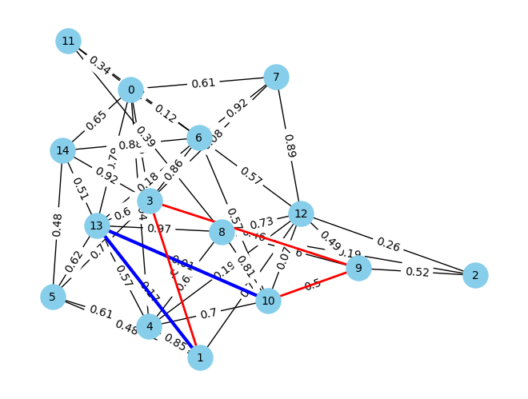
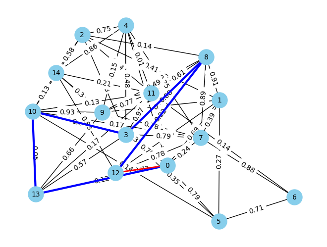
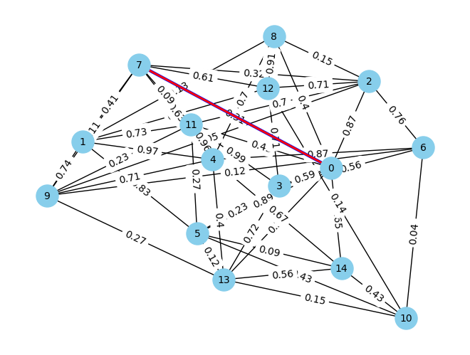

# Path Finding Algorithm Visualization

## Overview:
This repository demonstrates two main pathfinding algorithms: A* and Dijkstra. Both algorithms are tested on weighted and unweighted graphs that are generated randomly. Yes, the networkx has prebuilt path finding algorithms that can perform the same operation but it is important to understand the underlying concepts. The repository aims to provide an educational understanding of how these algorithms work in different scenarios, including the visual representation of the graph and the paths found. 

For ease of observation, graphs displayed on this github repository only shows weighted/unweighted graphs with 10-15 nodes. Of course, both pathfinding algorithms can be implemented on larger graphs if need be.

## Visual Results:
<p align="center">
  
  <br>
  <em>Dijkstra finds shortest route but AStar returned answer faster.</em>
</p>

<p align="center">
  
  <br>
  <em>Dijkstra finds the shortest route in a weighted graph but AStar returns answer faster </em>
</p>

<p align="center">
  
  <br>
  <em>Both algorithms found the same route</em>
</p>


## Features
- Graph Generation: Random weighted or unweighted graphs can be generated with configurable parameters like the number of nodes and allowance of orphan nodes (nodes without any connections).
- Graph Visualization: The generated graphs are visualized using matplotlib, providing a clear picture of nodes, edges, and weights.
- Dijkstra's Algorithm: Finds the shortest path from the source to the target using weights.
- A Algorithm*: Uses a heuristic function (in this case, node positions) to optimize pathfinding.
- Interactive Tests: Functions to test both algorithms with adjustable parameters to better understand their behavior.

## Usage
To test the pathfinding algorithms, simply run the script:
```bash
python pathfinding_visualization.py
```
This script will generate a graph with random weights, visualize the graph with plt and run both pathfinding algorithms on the generated graph. The results will be displayed along with the shortest paths found on the generated graph.